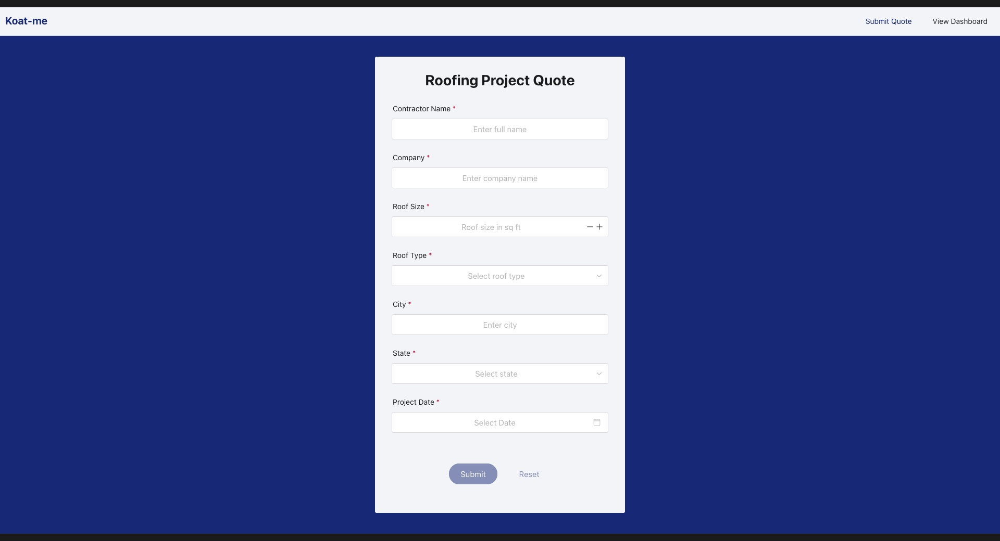
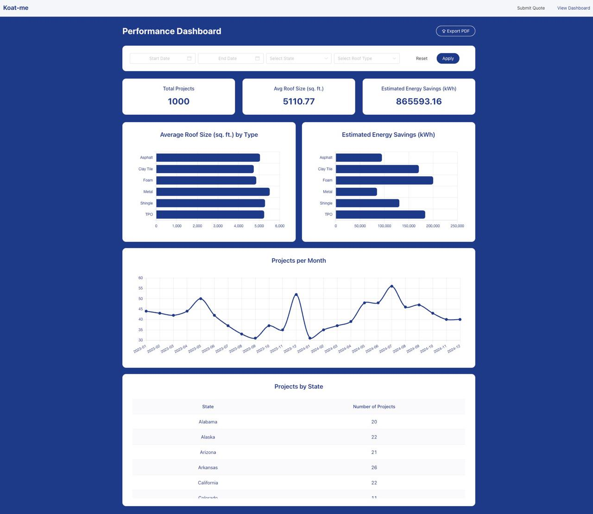

<p align="center">
  
</p>

# Koat-Me

A full-stack quote portal and performance dashboard tailored for roofing projects. Users can submit project quotes, while admins or business users can visualize aggregated data through insightful charts and summaries.

## 📖 Table of Contents

- [🧠 Abstract](#-abstract)
- [⚙️ Setup Instructions](#-setup-instructions)
- [✨ Extras](#-extras)
- [🚀 What Can Be Improved](#-what-can-be-improved)
- [📸 Gallery] (#-gallery)
- [📚 Documentation](#-docs)
  - [Frontend](#frontend)
  - [Backend](#backend)
  - [API Endpoints](#api-endpoints)
  - [Database Schema](#database-schema)

## 🧠 Abstract

Koat-Me is a modern full-stack web application that supports:

- **Quote Form**: Allows users to submit detailed roofing project quotes.
- **Performance Dashboard**: Displays interactive charts including:
  - Projects by state
  - Average roof size by roof type
  - Estimated energy savings
  - Monthly project trends
- **PDF Export**: Users can export dashboard data as a professionally formatted PDF.

## ⚙️ Setup Instructions

### 🧰 Tools Used

| Layer    | Tech Stack                      |
| -------- | ------------------------------- |
| Frontend | Vue 3, Vite, Naive UI, Chart.js |
| Backend  | Node.js, Express, Prisma        |
| Database | PostgreSQL (Dockerized)         |
| Misc     | html2pdf.js, date-fns, yarn     |

### 🖥️ Requirements

- Node.js v18+
- Yarn
- Docker & Docker Compose
- Git Bash or Unix-like shell (or WSL on Windows)

### 🔧 Running Locally

```bash
# Clone the repository
git clone https://github.com/aad8ya/koat_me.git
cd koat_me

# Remove .example extension from .env.example (modify values if required)
# Load .env variables into memory (e.g.: direnv allow .)
# Ensure docker is running

# Run setup script
./start-app.sh --setup

# Alternatively to just start the app (assuming DB is already setup):
./start-app.sh
```

```bash
# Manual setup

# Clone the repository
git clone https://github.com/aad8ya/koat_me.git
cd koat_me

# Remove .example extension from .env.example (modify values if required)
# Load .env variables into memory (e.g.: direnv allow .)
# Ensure docker is running

docker-compose up -d

cd backend

yarn setup:db
yarn seed
yarn install
yarn dev

# In another terminal inside /koat_me
cd frontend

yarn install
yarn dev
```

This runs:

- 🐘 **PostgreSQL container** using Docker Compose
- 🚀 **Backend** (Node.js + Express + Prisma) with API routes
- 🎨 **Frontend** (Vue 3 + Vite) served on `localhost:5002`

```bash
# To kill processes spawned by startup script
lsof -i :5001 # or your port if modified in.env
kill -9 <pid>
lsof -i :5002 # or your port if modified in.env
kill -9 <pid>
```

## ✨ Extras

This project includes several enhancements to improve developer experience, usability, and scalability:

- 🐳 **Dockerized Database**  
  PostgreSQL runs inside a Docker container, isolated from your host machine. Configuration is driven by environment variables in `.env`.

- 🔧 **Prisma ORM**  
  Prisma handles database schema definition, type-safe queries, migrations, and seeding.

- 🚀 **Startup Script**  
  The `start-app.sh` script handles both full setup (`--setup`) and regular app startup, saving time and ensuring consistency across environments.

## 🧠 What I'd Improve With More Time

Given more development time, these would be the next steps:

- 🔐 **Authentication and Authorization**  
  Add user login, admin-only dashboard, and token-based APIs.

- 🧪 **Testing Infrastructure**  
  Add unit and integration testing using `Vitest` or `Cypress`.

- 💄 **Enhance UI**  
  Make the UI more dynamic, interactive and include animations for charts.

- ⚙️ **Backend Refactors**  
  Introduce services for better modularity and scalability.

- 📈 **Advanced Analytics**  
  Support comparative analytics, forecasting, and downloadable CSVs.

- 🌐 **Production Deployment**  
  Set up CI/CD with Docker Compose and deploy via AWS.

- 🗃️ **Persistent Storage**  
  Optionally connect to a cloud-hosted PostgreSQL for persistent data across restarts.

## Gallery

<p align="center">
  
</p>
<p align="center">
  
</p>

## 📚 Docs

### 📦 Backend

- **Tech**: Node.js, Express, Prisma ORM, PostgreSQL
- **Endpoints**:
  - `POST /api/submit` — Submit a roofing project quote
  - `GET /api/quotes` — Fetch quotes with optional filters on state and roof type
  - `GET /api/roof-types` — Fetch roof type options
  - `POST /api/roof-types` — Add new roof type
  - `GET /api/dashboard-summary` — Retrieve dashboard data with optional filters on state, roof type, project date range.

### 🎨 Frontend

- **Tech**: Vue 3, Vite, Naive UI, Chart.js
- **Features**:
  - Responsive quote form
  - Live charts and stats from backend
  - Date and category filters
  - Export-to-PDF functionality

### 📊 Dashboard Charts

- Projects by State (table)
- Average Roof Size by Roof Type (bar chart)
- Estimated Energy Savings by Roof Type (bar chart)
- Monthly Projects Trend (line chart)
- Summary Cards with totals and averages

### 📂 Mock Data

The `seed.js` file inserts:

- 1000 roofing project entries
- 6 roof types with varying energy savings rates
- Random US states and cities
- Realistic dates to enable monthly trend analysis

## Made with ❤️ by

**Adithya Ganesan**  
＠ [aad8ya](adithyaganesan@outlook.com)
